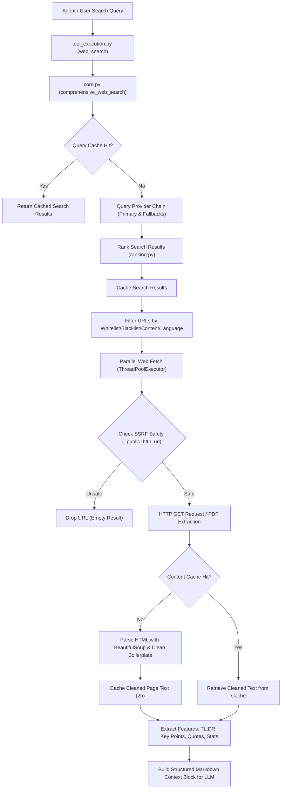

# Web Search, Scraping, and Summarization Pipeline

This document provides a detailed breakdown of the web search, page scraping, and content extraction architecture used in this repository. Use this guide to recreate the same robust, secure, and fallback-tolerant pipeline in your own platforms.

---

## 1. System Architecture

The following diagram illustrates the lifecycle of a search query: from input parsing to parallel, SSRF-safe page fetching, re-ranking, cleaning, and metric extraction.



---

## 2. Key Component Directory & File Mapping

To implement this, structure your codebase with the following modules:

* **Entry point**: Handles parameter checking, query sanitization, and LLM tool interfaces.
  * *Reference file*: [`src/tool_execution.py`](file:///wsl.localhost/Ubuntu-22.04/home/sal/odysseus/src/tool_execution.py)
* **Core Orchestrator**: Manages fallback provider loops, parallel fetching threads, URL filtering, and orchestrating the final output.
  * *Reference file*: [`services/search/core.py`](file:///wsl.localhost/Ubuntu-22.04/home/sal/odysseus/services/search/core.py)
* **Search Providers**: Wrappers for external search APIs (SearXNG, Google, Brave, Tavily, Serper, DuckDuckGo) that standardize outputs to a unified schema: `{"title": str, "url": str, "snippet": str, "age": Optional[str]}`.
  * *Reference file*: [`services/search/providers.py`](file:///wsl.localhost/Ubuntu-22.04/home/sal/odysseus/services/search/providers.py)
* **Ranking Engine**: Custom sorting heuristic prioritizing relevant titles, trusted domains, recent dates, and content freshness.
  * *Reference file*: [`services/search/ranking.py`](file:///wsl.localhost/Ubuntu-22.04/home/sal/odysseus/services/search/ranking.py)
* **Scraper & Summarizer**: Safe HTTP fetcher with SSRF detection, HTML cleaner, PDF text parser, and regex summary miners.
  * *Reference file*: [`services/search/content.py`](file:///wsl.localhost/Ubuntu-22.04/home/sal/odysseus/services/search/content.py)

---

## 3. Step-by-Step Implementation Guide

### Phase 1: Query Prep & Freshness Detection
Before running the search, analyze the query to infer the required date filters if not explicitly provided:
* Parse keywords like `"today"`, `"latest"`, `"breaking"`, `"right now"` $\rightarrow$ Set time window to **1 day** (`day`).
* Parse keywords like `"this week"`, `"recent news"` $\rightarrow$ Set time window to **1 week** (`week`).
* Parse keywords like `"this month"` $\rightarrow$ Set time window to **1 month** (`month`).

### Phase 2: Fallback Querying Loop
Configure primary and fallback providers. If the primary provider triggers a rate limit (`429`), network timeout, or returns 0 results, intercept the exception and query the next provider.
```python
# Fallback strategy implementation skeleton
provider_chain = ["searxng", "duckduckgo"]  # Configure order
results = []

for provider_name in provider_chain:
    for attempt in range(2):  # Retry up to twice per provider
        try:
            results = call_provider(provider_name, query, count, time_filter)
            if results:
                break
        except (NetworkError, ParseError, RateLimitError) as e:
            log_error(f"{provider_name} failed: {e}")
    if results:
        break  # Move on once we have results
```

### Phase 3: Relevance & Trusted Domain Re-ranking
Standardize ranking by calculating a combined score for each result:

$$\text{Total Score} = 2.0 \cdot \text{TitleRelevance} + 1.0 \cdot \text{SnippetRelevance} + 1.5 \cdot \text{DomainScore} + 1.0 \cdot \text{RecencyScore} + \text{NewsQualityAdjustment}$$

* **Title Relevance**: Calculate matching terms between the query and result title.
* **Domain Score**: Assign weights depending on domain endings and trust lists:
  * `.edu`, `.gov`, or trusted global sources (e.g. `apnews.com`, `reuters.com`) $\rightarrow$ **1.0**
  * `.org` domains $\rightarrow$ **0.7**
  * Generic domains $\rightarrow$ **0.4**
* **Recency Score**: Parse age strings.
  * Age $\le 7$ days $\rightarrow$ **1.0**
  * Age $\ge 30$ days $\rightarrow$ **0.0**
  * In between: Linearly interpolate $(30 - \text{days\_old}) / 23$.

---

## 4. Phase 4: SSRF-Safe Scraping & HTML Heuristics

To securely fetch third-party page content without exposing internal resources:

### 1. SSRF DNS Resolver Validation
Resolve hostnames before initiating the HTTP GET request. Reject private networks, loopbacks, and link-local ranges:

```python
import ipaddress
import socket
from urllib.parse import urlparse

PRIVATE_NETWORKS = (
    ipaddress.ip_network("0.0.0.0/8"),
    ipaddress.ip_network("10.0.0.0/8"),
    ipaddress.ip_network("127.0.0.0/8"),
    ipaddress.ip_network("169.254.0.0/16"),
    ipaddress.ip_network("172.16.0.0/12"),
    ipaddress.ip_network("192.168.0.0/16"),
    ipaddress.ip_network("::1/128"),
    ipaddress.ip_network("fc00::/7"),
    ipaddress.ip_network("fe80::/10"),
)

def is_public_url(url: str) -> bool:
    try:
        parsed = urlparse(url)
        if parsed.scheme not in ("http", "https"):
            return False
        
        host = (parsed.hostname or "").strip().lower()
        if host in ("localhost", "metadata", "metadata.google.internal") or host.endswith(".local"):
            return False
            
        # Resolve all associated IP addresses
        addr_infos = socket.getaddrinfo(host, None)
        ips = [ipaddress.ip_address(info[4][0]) for info in addr_infos]
        
        # Check against private network ranges
        for ip in ips:
            if ip.is_private or ip.is_loopback or ip.is_link_local or any(ip in net for net in PRIVATE_NETWORKS):
                return False
        return True
    except Exception:
        return False
```

### 2. BeautifulSoup Content Extraction
Use the following strategy to extract real content instead of cookie banners and footers:
1. Target elements `<main>`, `<article>`, `<section>`, or `<div>` having class names containing: `content`, `main`, `body`, `article`, `post`, `entry`, or `text`.
2. Clean spaces and extract text.
3. **Fallback Strategy**: If the resulting text is $< 600$ characters, parse the entire `<body>` tag but explicitly extract and destroy layout "noise" elements:
   ```python
   for noise in body.find_all(["script", "style", "noscript", "template", "nav", "header", "footer", "aside"]):
       noise.extract()
   ```

---

## 5. Phase 5: Summarization & Feature Extraction Algorithms

Once raw webpage text is extracted, apply regex rules to compute summaries and data properties:

### 1. Key Points Extractor
Captures bullet-pointed items from the page content.
```python
import re

def extract_key_points(text: str) -> list[str]:
    points = []
    bullet_pattern = re.compile(r"^\s*[-*•]\s+(.*)")
    numbered_pattern = re.compile(r"^\s*\d+[\.\)]\s+(.*)")
    for line in text.splitlines():
        match = bullet_pattern.match(line) or numbered_pattern.match(line)
        if match:
            points.append(match.group(1).strip())
    return points
```

### 2. First-sentence TL;DR
Generates a TL;DR summary using the top 3 sentences of the text.
```python
def get_tldr(text: str, max_sentences: int = 3) -> str:
    sentences = re.split(r"(?<=[.!?])\s+", text)
    selected = [s.strip() for s in sentences if s]
    return " ".join(selected[:max_sentences])
```

### 3. Excerpt Quote Miner
Extracts quotes enclosed within matches that are long enough to hold semantic meaning.
```python
def extract_quotes(text: str) -> list[str]:
    # Matches double or single quotes containing at least 15 characters
    pattern = r'(["\'])([^"\']{15,500}?)\1'
    return [match.group(2).strip() for match in re.finditer(pattern, text)]
```

### 4. Statistic and Number Miner
Finds raw numbers, currencies, dates, and percentages representing facts.
```python
def extract_statistics(text: str) -> list[str]:
    # Matches comma-grouped numbers, decimals, or plain numbers followed by metrics or percentages
    pattern = re.compile(
        r"\b(?:\d{1,3}(?:,\d{3})+|\d+)(?:\.\d+)?\s*(%|percent|€|USD|per cent|[a-zA-Z]+)?",
        re.IGNORECASE
    )
    return [match.group(0).strip() for match in pattern.finditer(text)]
```

### 5. Final Output Formatting
Pack the summaries, extracted statistics, metadata, and truncated text bodies into a formatted Markdown layout. Provide explicit instruction tags (e.g. ```` ```sources ````) telling your agent LLM how to parse, weight, and cite the source index in its final responses.
